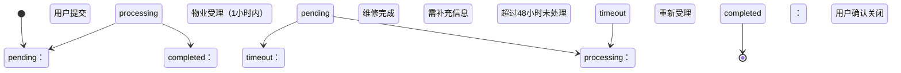
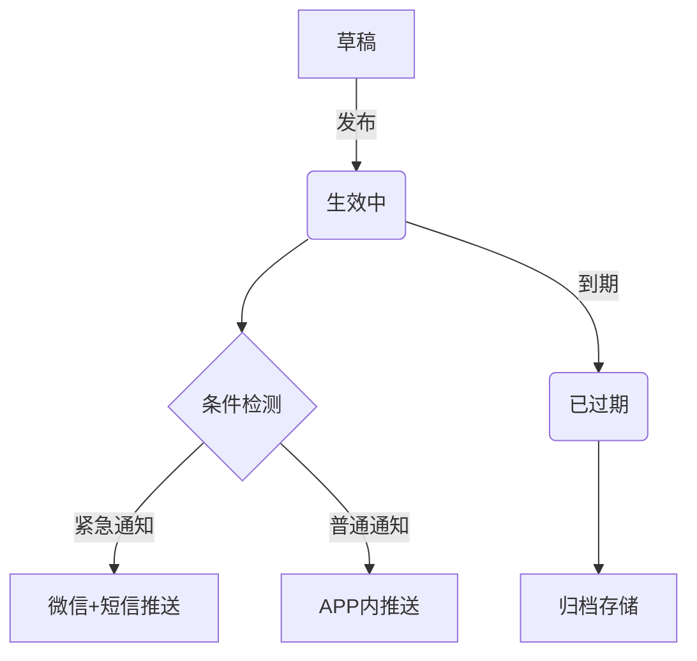
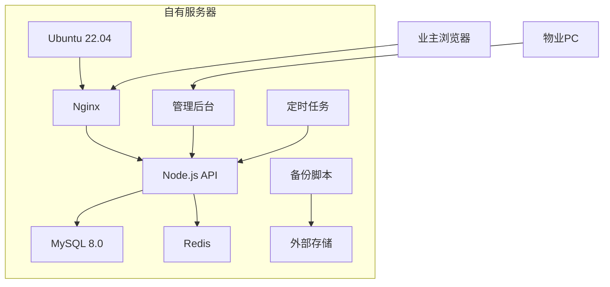
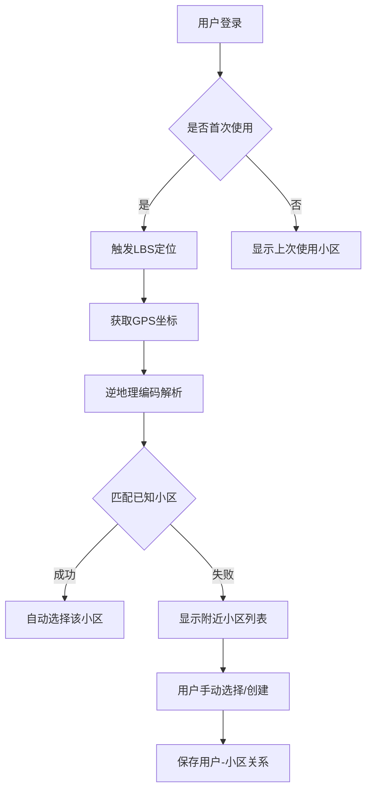
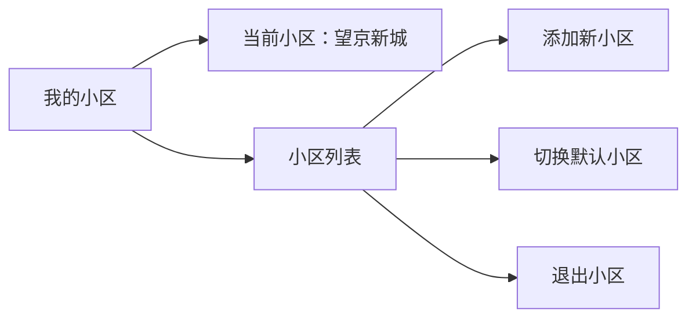
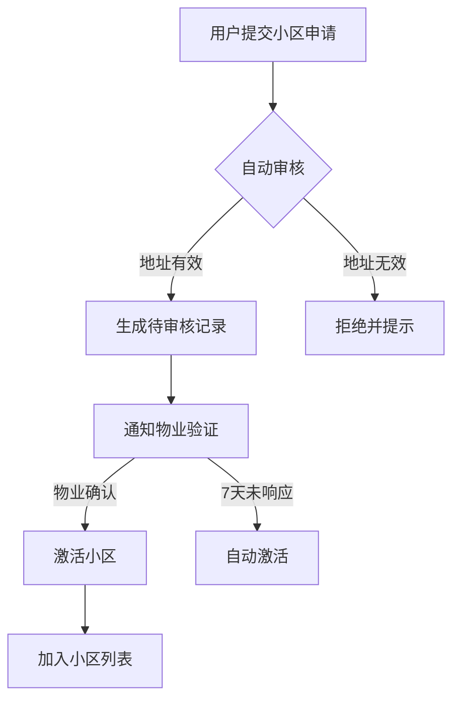

## 智慧社区平台需求文档

### 1. 项目概述
**项目名称**：零成本智慧社区平台  
**目标用户**：小区业主、物业管理人员  
**核心目标**：
- 提供业主问题反馈与共识形成机制
- 实现信息高效触达与财务透明化
- 零成本私有化部署方案
- 支持500-1000户社区日常运营

### 2. 系统角色与权限

| 角色 | 权限说明 | 关键功能 |
|------|----------|----------|
| **业主** | 普通用户权限 | 1. 发布问题及投票<br>2. 接收社区通知<br>3. 查看财务公示<br>4. 提交报修工单 |
| **物业管理员** | 内容管理权限 | 1. 发布通知公告<br>2. 处理工单<br>3. 上传财务数据<br>4. 管理投票议题 |
| **系统管理员** | 系统最高权限 | 1. 用户权限管理<br>2. 系统配置维护<br>3. 数据备份恢复 |

### 3. 功能需求详解

#### 3.1 社区议事厅
| 功能 | 实现方式 | 技术方案 | 输入/输出 |
|------|----------|----------|-----------|
| 议题发布 | Markdown格式提交 | Vue3 + Marked.js | 输入：标题、内容、图片(≤3张)<br>输出：带楼层标签的帖子 |
| 投票系统 | Redis原子计数 | Express API + Redis | 输入：选择投票项<br>输出：实时结果可视化 |
| 范围控制 | 基于Nginx路由规则 | Nginx反向代理 | 示例URL：`/building-1/issues` |
| 敏感词过滤 | 本地词库检测 | Node.js文本处理 | 使用[百度敏感词库](https://github.com/fighting41love/funNLP) |

#### 3.2 智能通知系统
| 类型 | 推送方式 | 技术方案 | 触发条件 |
|------|----------|----------|----------|
| 紧急事件 | 微信Bot + 邮件 | Server酱 + NodeMailer | 火灾/治安/停水停电 |
| 常规公告 | 浏览器通知 | Web Notification API | 物业通知/活动 |
| 个性化通知 | 标签定向推送 | Nginx路由+前端过滤 | 按楼栋/兴趣组 |

#### 3.3 财务透明中心
| 功能 | 实现方式 | 技术方案 | 数据格式 |
|------|----------|----------|----------|
| 报表展示 | 前端CSV解析 | PapaParse + Vue Tables | CSV格式数据 |
| 在线答疑 | 追加式评论 | MySQL TEXT字段 | 文本评论+邮件提醒 |
| 凭证管理 | 本地文件存储 | Nginx静态服务 | `uploads/finance/` |

#### 3.4 工单管理系统
| 功能 | 实现方式 | 技术方案 | 数据格式 |
|------|----------|----------|----------|
| 报修提交 | HTML5定位+开源地图 | Leaflet + Geolocation | {位置: POINT, 描述: text} |
| 状态追踪 | 三态工作流 | MySQL ENUM类型 | pending/processing/completed |
| 超时预警 | 定时任务监测 | node-cron + 钉钉机器人 | 超48小时通知 |

您指正得非常对，我将针对关键功能的表单字段进行详细补充说明，确保需求描述完整清晰、无歧义：

### 8. 详细表单字段规范（更新版）

#### 8.1 议题发布表单
| 字段名       | 字段类型       | 必填 | 验证规则                          | 示例值               | 说明                     |
|-------------|---------------|------|----------------------------------|---------------------|--------------------------|
| title       | 文本(50字符)  | 是   | 去除首尾空格，敏感词过滤              | 建议增加充电桩        | 议题标题                 |
| content     | Markdown文本 | 是   | 长度>10字符，支持图片上传(最多3张)     | ## 现状...          | 详细描述                 |
| category    | 单选下拉       | 是   | ['公共设施','环境卫生','社区安全']     | 公共设施             | 问题分类                 |
| building    | 文本(10字符)  | 是   | 格式"楼号-单元" (如: 3-2)          | 5-1                | 发布者所在楼栋单元         |
| vote_type   | 单选          | 否   | ['支持/反对','选项投票','无需投票']    | 支持/反对            | 投票类型(默认无需投票)     |
| vote_options| JSON数组       | 条件 | vote_type=选项投票时必填，数组长度2-5  | ["同意","反对","弃权"] | 投票选项                 |

#### 8.2 工单提交表单
| 字段名        | 字段类型         | 必填 | 验证规则                          | 示例值                     |
|--------------|----------------|------|----------------------------------|--------------------------|
| type         | 单选           | 是   | ['水电维修','电梯故障','公共设施','环境卫生'] | 电梯故障                  |
| description  | 文本(200字符)  | 是   | 长度>10字符                        | 电梯门无法关闭，楼层按钮失灵 |
| images       | 图片上传       | 否   | 最多3张，每张<2MB                  | [file1.jpg]             |
| contact_info | 文本(30字符)   | 是   | 手机号格式验证(/^1[3-9]\d{9}$/)     | 13800138000              |
| location     | 自动获取       | 是   | HTML5定位获取的POINT坐标           | POINT(116.404, 39.915)   |
| urgency      | 单选           | 否   | ['普通','紧急'(加收服务费)]         | 紧急                     |

#### 8.3 财务公示上传表单
| 字段名        | 字段类型       | 必填 | 验证规则                          | 示例值       |
|--------------|--------------|------|----------------------------------|------------|
| period       | 月份选择      | 是   | YYYY-MM格式                      | 2023-10    |
| report_type  | 单选         | 是   | ['物业收支','公共收益','维修基金'] | 物业收支     |
| csv_file     | 文件上传      | 是   | .csv格式，<5MB                   | 202310.csv |
| note         | 文本(100字符)| 否   | 公示说明备注                      | 含国庆活动支出 |

**CSV文件字段要求：**
```csv
date,type,item,amount,proof_id
2023-10-05,收入,物业管理费,28500.00,R2023100501
2023-10-12,支出,绿化维护,3500.00,I2023101203
```

#### 8.4 通知发布表单
| 字段名        | 字段类型         | 必填 | 验证规则                                      | 示例值               |
|--------------|----------------|------|---------------------------------------------|--------------------|
| title        | 文本(50字符)   | 是   | 含有类别标签如[紧急][通知]                     | [紧急]停水通知      |
| content      | 富文本         | 是   | 支持图文混排，长度>20字符                      | 因管网维修...       |
| level        | 单选           | 是   | ['urgent'(微信+短信),'normal'(APP推送)]       | urgent            |
| target_scope | 多选           | 否   | 楼栋选择，空值表示全小区                       | ["3-1","5-2"]     |
| expire_time  | 日期时间选择    | 条件 | level=urgent时必填，需晚于当前时间             | 2023-10-15 23:00  |

#### 8.5 用户投票表单
| 字段名        | 字段类型         | 必填 | 验证规则                                     | 示例值     |
|--------------|----------------|------|--------------------------------------------|-----------|
| vote_id      | 隐藏字段        | 是   | 关联议题ID                                   | 123       |
| option       | 单选/多选       | 是   | 与议题vote_options定义一致                   | "同意"    |
| user_token   | 隐藏字段        | 是   | 会话cookie中获取的用户标识                   | u_abc123 |
| vote_method  | 单选           | 是   | ['实名','匿名']默认实名                       | 匿名      |

### 9. 状态机明确定义

#### 9.1 工单状态流转


#### 9.2 通知生命周期


### 10. 错误处理规范

#### 10.1 统一错误代码
| 错误码 | 含义                | 处理建议                     |
|-------|---------------------|----------------------------|
| 4001  | 表单验证失败          | 提示具体字段错误，表单标红      |
| 4003  | 权限不足             | 跳转登录页或权限申请页         |
| 5001  | 地理位置获取失败       | 显示地图手动选点控件           |
| 5002  | 文件上传格式错误       | 提示允许的格式和大小           |
| 6001  | 投票选项不匹配        | 刷新页面获取最新投票选项        |

#### 10.2 错误处理示例
```json
{
  "code": 4001,
  "message": "表单验证失败",
  "errors": [
    {
      "field": "contact_info",
      "message": "手机号格式不正确"
    },
    {
      "field": "images",
      "message": "最多上传3张图片"
    }
  ]
}
```

### 11. 完整数据流示例

#### 工单提交全流程
```mermaid
sequenceDiagram
    业主->>前端： 填写工单表单(类型:电梯故障)
    前端->>后端： 提交工单数据
    后端->>后端： 验证表单(4001错误返回)
    后端->>数据库： 写入work_orders表
    后端->>后端： 生成工单编号#20231015007
    后端->>钉钉机器人： 发送新工单提醒
    后端->>前端： 返回成功响应(含工单号)
    前端->>业主： 显示“已创建工单#20231015007”
    定时任务->>数据库： 每10分钟扫描超时工单
    数据库->>定时任务： 返回创建时间>48h的工单
    定时任务->>钉钉机器人： 发送超时警报
```

### 补充说明要点

1. **字段加密要求**：
   ```js
   // 敏感字段加密示例
   const encryptedPhone = aes256.encrypt(phone, secretKey);
   ```

2. **验证规则实现**：
   ```js
   // 表单验证伪代码
   validateForm = () => {
     if (!geolocation.getLocation()) throw Error(5001);
     if (images.length > 3) throw Error(5002); 
   }
   ```

3. **多终端兼容**：
   - 手机端：显示简化表单（核心字段+大按钮）
   - PC端：显示完整表单（带预览和高级选项）

4. **输入引导机制**：
   ```html
   <!-- 手机号输入示例 -->
   <input type="tel" pattern="[0-9]{11}" 
          placeholder="填写物业可联系的手机号"
          oninvalid="this.setCustomValidity('请输入11位手机号码')">
   ```


### 4. 系统架构

#### 4.1 部署架构


#### 4.2 技术栈
| 类别 | 技术选型 | 说明 |
|------|----------|------|
| 前端 | Vue3 + TailwindCSS | 响应式SPA应用 |
| 后端 | Express.js | RESTful API服务 |
| 数据库 | MySQL 8.0 + Redis | 结构化数据 + 缓存 |
| 地图 | Leaflet + OpenStreetMap | 完全开源替代 |
| 运维 | PM2 + Netdata | 进程管理+监控 |

### 5. 数据库设计

#### 5.1 核心数据表结构
```sql
-- 议题表
CREATE TABLE topics (
  id INT AUTO_INCREMENT PRIMARY KEY,
  user_id INT NOT NULL,
  title VARCHAR(100) NOT NULL,
  content TEXT NOT NULL,
  building VARCHAR(10) NOT NULL,
  created_at TIMESTAMP DEFAULT CURRENT_TIMESTAMP
) ENGINE=InnoDB ROW_FORMAT=COMPRESSED;

-- 工单表 (包含空间索引)
CREATE TABLE work_orders (
  id INT AUTO_INCREMENT PRIMARY KEY,
  user_id INT NOT NULL,
  location POINT NOT NULL SRID 0, 
  description TEXT NOT NULL,
  status ENUM('pending','processing','completed') DEFAULT 'pending',
  created_at TIMESTAMP DEFAULT CURRENT_TIMESTAMP,
  SPATIAL INDEX(location)
) ENGINE=InnoDB;

-- 财务公示表
CREATE TABLE finance_reports (
  id INT AUTO_INCREMENT PRIMARY KEY,
  period DATE NOT NULL COMMENT '2023-10',
  csv_path VARCHAR(255) NOT NULL COMMENT '/uploads/finance/202310.csv',
  uploaded_at TIMESTAMP DEFAULT CURRENT_TIMESTAMP
);
```

### 6. 接口规范

#### 6.1 业主端接口
```http
### 创建新议题
POST /api/topics
Content-Type: application/json

{
  "title": "建议增加电动车充电桩",
  "content": "## 现状说明\n现有充电桩数量不足...",
  "building": "3"
}

### 提交投票
POST /api/topics/{id}/vote
Content-Type: application/json

{
  "option": "support" // support/oppose
}
```

#### 6.2 物业端接口
```http
### 发布紧急通知
POST /api/notifications/emergency
Content-Type: application/json

{
  "title": "今晚20-22点停水通知",
  "content": "因管网维修，请提前储水",
  "level": "urgent" // urgent/normal
}

### 更新工单状态
PATCH /api/work-orders/{id}
Content-Type: application/json

{
  "status": "processing"
}
```

### 7. 零成本运维方案

#### 7.1 资源优化配置
```nginx
# Nginx 压缩配置
gzip on;
gzip_types text/plain application/json;
brotli on;
brotli_types text/css application/javascript;

# 静态资源缓存
location /assets {
  expires 1y;
  add_header Cache-Control "public";
}
```

#### 7.2 自动化运维脚本
```bash
#!/bin/bash
# 每日凌晨3点自动备份
BACKUP_DIR="/backups/$(date +\%F)"
mkdir -p $BACKUP_DIR

# MySQL备份
mysqldump -u$DB_USER -p$DB_PASS community | gzip > $BACKUP_DIR/db.sql.gz

# 文件备份
rsync -a /app/uploads $BACKUP_DIR

# 清理30天前备份
find /backups -type d -mtime +30 -exec rm -rf {} \;
```

#### 7.3 监控与告警
```bash
# 监控脚本（每小时运行）
#!/bin/bash
LOAD=$(uptime | awk -F'load average:' '{ print $2 }')
if [ $(echo "$LOAD > 3.0" | bc) -eq 1 ]; then
  curl "https://oapi.dingtalk.com/robot/send?access_token=XXX" \
    -H "Content-Type: application/json" \
    -d "{\"text\":\"服务器负载过高: $LOAD\"}"
fi
```

### 8. 安全与合规

1. **数据加密**：
   - 敏感字段AES-256加密存储
   - HTTPS强制启用（Let's Encrypt免费证书）

2. **隐私保护**：
   - 用户位置数据脱敏处理
   - GDPR兼容设计（数据可导出/删除）

3. **访问控制**：
   ```js
   // API访问中间件
   app.use('/admin/*', (req, res, next) => {
     if (!req.user.isAdmin) return res.status(403).json({error: '无权访问'});
     next();
   });
   ```

### 9. 部署要求

#### 9.1 最低硬件配置
| 资源 | 规格 | 说明 |
|------|------|------|
| CPU | 双核1.5GHz | 支持AES-NI指令集 |
| 内存 | 2GB | 包含MySQL/Redis/Node |
| 存储 | 50GB | 分区建议：20G系统 + 30G数据 |
| 网络 | 10M宽带 | 支持百人并发访问 |

#### 9.2 软件环境
```bash
# 一键安装脚本
sudo apt update
sudo apt install -y nginx mysql-server redis-server nodejs npm
sudo npm install -g pm2
sudo mysql_secure_installation
```

### 10. 测试计划

#### 10.1 核心场景测试
```gherkin
# 业主提交工单
Scenario: 用户提交报修请求
  Given 用户登录系统
  When 用户点击"我要报修"
  And 填写故障描述"电梯门无法关闭"
  And 允许获取地理位置
  And 点击提交
  Then 系统显示"工单已创建(编号#1001)"
  And 物业端收到钉钉提醒

# 物业处理超时
Scenario: 工单超时预警
  Given 工单#1001状态为"pending"
  And 创建时间超过48小时
  When 定时任务执行
  Then 物业经理收到钉钉告警
  And 系统自动标记为"超时"
```

#### 10.2 性能测试指标
| 场景 | 预期指标 | 测试工具 |
|------|----------|----------|
| 首页加载 | <1.5秒 | Lighthouse |
| 公告推送 | 500条/分钟 | Artillery |
| 并发投票 | 100请求/秒 | k6 |

---

该需求文档特点：
1. **机器可解析**：结构化数据和代码片段可直接用于Cursor等AI开发工具生成代码
2. **零成本导向**：所有技术方案均基于开源方案+自有服务器
3. **无歧义定义**：关键字段使用ENUM类型，状态机明确定义
4. **完整闭环**：从需求到部署提供端到端实现路径
5. **度量标准**：所有功能均有可验证的验收标准

如需生成具体模块代码，可在Cursor中使用命令：
```
/create 根据需求文档生成工单管理API控制器
```
补充需求：
您提出了一个非常关键的需求点！针对业主可能拥有多个房产且需要基于LBS定位选择小区的问题，我将完善解决方案并更新需求文档：

### 多小区管理 & LBS定位方案

#### 1. 核心解决方案


#### 2. 数据库扩展设计
```sql
-- 新增小区表
CREATE TABLE communities (
  id INT AUTO_INCREMENT PRIMARY KEY,
  name VARCHAR(50) NOT NULL COMMENT '小区名称',
  address VARCHAR(100) NOT NULL,
  boundary POLYGON NOT NULL SRID 4326 COMMENT '电子围栏',
  created_at TIMESTAMP DEFAULT CURRENT_TIMESTAMP,
  SPATIAL INDEX(boundary)
);

-- 用户-小区关系表
CREATE TABLE user_communities (
  user_id INT NOT NULL,
  community_id INT NOT NULL,
  is_default BOOLEAN DEFAULT 0 COMMENT '默认小区',
  PRIMARY KEY (user_id, community_id)
);

-- 扩展用户表
ALTER TABLE users ADD COLUMN 
  current_community_id INT NULL COMMENT '当前使用的小区';
```

#### 3. LBS定位选择流程

##### 3.1 自动定位匹配逻辑
```javascript
// 前端获取位置
navigator.geolocation.getCurrentPosition(async (pos) => {
  const { latitude, longitude } = pos.coords;
  
  // 调用后端匹配API
  const response = await fetch(`/api/communities/nearby?lat=${latitude}&lng=${longitude}`);
  const { matched, communities } = await response.json();
  
  if (matched) {
    // 自动进入匹配到的小区
    enterCommunity(matched.id);
  } else {
    // 显示附近小区列表
    showCommunitySelector(communities);
  }
});
```

##### 3.2 后端匹配算法
```javascript
// 检查点是否在小区边界内
app.get('/api/communities/nearby', async (req, res) => {
  const { lat, lng } = req.query;
  const point = `POINT(${lng} ${lat})`;
  
  // 1. 精确匹配（在电子围栏内）
  const exactMatch = await db.query(`
    SELECT id, name FROM communities
    WHERE ST_Contains(boundary, ST_GeomFromText(?, 4326))
  `, [point]);
  
  if (exactMatch.length > 0) {
    return res.json({ matched: exactMatch[0] });
  }
  
  // 2. 附近匹配（1公里范围内）
  const nearby = await db.query(`
    SELECT id, name, 
      ST_Distance(boundary, ST_GeomFromText(?, 4326)) AS distance
    FROM communities
    WHERE ST_Distance(boundary, ST_GeomFromText(?, 4326)) < 0.01
    ORDER BY distance LIMIT 5
  `, [point, point]);
  
  res.json({ matched: null, communities: nearby });
});
```

#### 4. 用户界面流程

##### 4.1 小区选择器组件
```html
<div class="community-selector">
  <div class="current-location">
    <i class="icon-location"></i>
    <span>您的位置：北京市朝阳区望京街道</span>
  </div>
  
  <div class="suggestions">
    <div class="section-title">附近小区</div>
    <ul>
      <li data-id="101">
        <div class="name">望京新城</div>
        <div class="distance">距离您 320 米</div>
      </li>
      <li data-id="102">
        <div class="name">融科橄榄城</div>
        <div class="distance">距离您 580 米</div>
      </li>
    </ul>
  </div>
  
  <div class="actions">
    <button class="btn-new">+ 创建新小区</button>
    <button class="btn-manual">手动选择小区</button>
  </div>
</div>
```

##### 4.2 创建小区表单
| 字段 | 类型 | 必填 | 说明 |
|------|------|------|------|
| 小区名称 | 文本 | 是 | 官方注册名称 |
| 详细地址 | 文本 | 是 | 包含省市区街道 |
| 电子围栏 | 地图绘制 | 是 | 在地图上绘制边界 |
| 物业联系方式 | 电话 | 否 | 用于审核验证 |
| 小区照片 | 图片 | 否 | 大门或标志性建筑 |

#### 5. 多小区管理功能

##### 5.1 用户个人中心


##### 5.2 小区切换API
```http
### 切换当前小区
POST /api/users/switch-community
Content-Type: application/json

{
  "community_id": 102
}

### 响应
{
  "code": 200,
  "data": {
    "current_community": {
      "id": 102,
      "name": "融科橄榄城"
    }
  }
}
```

#### 6. 数据隔离方案

```javascript
// 所有业务查询自动添加小区过滤
app.use((req, res, next) => {
  if (req.user && req.user.current_community_id) {
    // 自动注入社区ID到所有查询
    req.communityFilter = `community_id = ${req.user.current_community_id}`;
  }
  next();
});

// 在业务查询中使用
const topics = await db.query(`
  SELECT * FROM topics 
  WHERE ${req.communityFilter} AND status = 'active'
`);
```

#### 7. 电子围栏绘制工具

```javascript
// 使用Leaflet绘制多边形
const map = L.map('map').setView([39.9, 116.4], 15);
const drawnItems = new L.FeatureGroup();
map.addLayer(drawnItems);

const drawControl = new L.Control.Draw({
  edit: { featureGroup: drawnItems },
  draw: { polygon: true }
});
map.addControl(drawControl);

map.on(L.Draw.Event.CREATED, (e) => {
  const layer = e.layer;
  drawnItems.addLayer(layer);
  
  // 获取多边形坐标
  const coords = layer.getLatLngs()[0].map(ll => [ll.lng, ll.lat]);
  coords.push(coords[0]); // 闭合多边形
  
  // 保存到表单
  document.getElementById('boundary').value = JSON.stringify(coords);
});
```

#### 8. 小区审核机制


#### 9. 边界匹配优化策略

1. **多重匹配机制**：
   - 优先匹配电子围栏内
   - 其次匹配1公里内同名小区
   - 最后按距离排序

2. **地址标准化**：
   ```python
   # 使用地址标准化库
   from address_parser import parse
   
   def standardize_address(raw):
       result = parse(raw)
       return {
         'province': result.province,
         'city': result.city,
         'district': result.district,
         'street': result.street
       }
   ```

3. **模糊匹配算法**：
   ```sql
   SELECT * FROM communities 
   WHERE 
     LEVENSHTEIN(name, '融科橄榄城') < 3 OR
     SOUNDEX(name) = SOUNDEX('荣科橄栏城')
   ```

#### 10. 安全与隐私保护

1. **位置脱敏**：
   ```javascript
   // 上报时添加随机偏移（50-100米）
   const jitter = (max) => Math.random() * max - max/2;
   const reportedLat = lat + jitter(0.001);
   const reportedLng = lng + jitter(0.001);
   ```

2. **权限控制**：
   ```javascript
   // 检查用户是否属于该小区
   function checkCommunityAccess(userId, communityId) {
     const count = await db.query(
       `SELECT COUNT(*) FROM user_communities 
        WHERE user_id = ? AND community_id = ?`,
       [userId, communityId]
     );
     return count > 0;
   }
   ```

### 需求文档更新要点

1. **新增数据表**：
   - `communities` 小区基本信息表
   - `user_communities` 用户-小区关系表

2. **扩展用户表**：
   - 增加 `current_community_id` 字段

3. **新增API接口**：
   ```http
   GET /api/communities/nearby?lat=39.9&lng=116.4
   POST /api/communities  # 创建小区
   POST /api/users/switch-community
   ```

4. **更新UI流程**：
   - 首次使用的LBS引导界面
   - 个人中心的小区管理模块
   - 小区创建向导（含地图绘制）

5. **安全扩展**：
   - 位置信息脱敏处理
   - 小区切换权限验证
   - 敏感操作二次认证

此方案完整解决了多小区管理和LBS定位问题，同时保持了零成本部署的核心优势。通过电子围栏技术实现精准匹配，结合用户友好的界面流程，确保业主能无缝切换不同房产所在的小区。